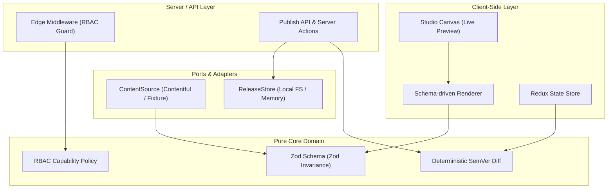

# <p align="center"> Page Studio</p>

<p align="center">
  <strong>A modern, schema-driven page orchestrator and publishing workspace.</strong>
</p>

<p align="center">
  
  
  
  
  
</p>

---

Page Studio allows you to load landing pages from Contentful (or offline mock fixtures), edit them in a lightweight, responsive WYSIWYG-lite studio, preview the live layout, and publish **immutable, automatically-versioned releases** with strict RBAC, comprehensive accessibility, and automated CI validations.

Built with **Next.js (App Router) · TypeScript · Redux Toolkit · Contentful · Tailwind · shadcn/ui · Zod · dnd-kit · Playwright + axe · GitHub Actions**.

---

## 🚀 Quick Start

```bash
# 1. Clone & Install dependencies
npm install

# 2. Configure environment (works out-of-the-box using local mock fixtures)
cp .env.example .env

# 3. Generate a session key in your .env
# Set AUTH_SECRET to a 32-byte hex string (e.g., run `openssl rand -hex 32` or any random hex string)

# 4. Start the development server
npm run dev
```

> [!NOTE]  
> **No Contentful account is required to evaluate Page Studio.**  
> When credentials are absent or `USE_FIXTURE_CONTENT=true` is set, the application serves deterministic offline mock data through the exact same adapter interface. To test with live Contentful services, configure your `CONTENTFUL_*` keys inside `.env` and set `USE_FIXTURE_CONTENT=false`.

---

## 🔐 Demo Logins & Role-Based Access (RBAC)

Sign in at [http://localhost:3000/login](http://localhost:3000/login) with one of the following mock user roles to test the system's permission constraints:

| Role | Username / Password | Capabilities |
| :--- | :--- | :--- |
| **Viewer** | `viewer` / `viewer` | Preview-only mode; cannot edit drafts or publish releases. |
| **Editor** | `editor` / `editor` | Preview + modify section layout/properties; cannot publish. |
| **Publisher** | `publisher` / `publisher` | Complete access: preview, edit layout, and **publish new versions**. |

---

## 📂 Project Structure

```
src/
├── app/                       # Next.js App Router Pages & API Routes
│   ├── page.tsx               # Homepage / Landing page list
│   ├── login/                 # Accessible credentials login portal
│   ├── denied/                # RBAC restriction page
│   ├── preview/[slug]/        # Live responsive page preview renderer
│   ├── studio/[slug]/         # Studio editing canvas (Redux client shell)
│   └── api/
│       ├── publish/           # Secure server-side versioning & publish endpoint
│       └── releases/[slug]/   # REST endpoint returning published releases list
├── core/                      # ── Pure Domain Layer (Framework Agnostic) ──
│   ├── schema.ts              # Zod composition schemas & strict TypeScript definitions
│   ├── validation.ts          # Page-level validation & degradation policy
│   ├── semver/                # Version diff logic (patch / minor / major classification)
│   └── auth/roles.ts          # RBAC model & route-level permission configuration
├── components/                # ── UI Elements & Renderer ──
│   ├── ui/                    # Base visual primitives (shadcn/ui custom components)
│   ├── sections/              # Page modules: Hero, FeatureGrid, Testimonial, CTA, etc.
│   ├── renderer/              # Dynamic page & section boundary renderers
│   └── layout/                # Main site-header & logo branding elements
├── features/studio/           # Drag-and-drop hierarchy panel, viewport tools, properties inspector
├── store/                     # Redux state tree: slices, local persistence middleware, selectors
├── server/                    # ── Data Adapters & Infrastructure (Server Only) ──
│   ├── contentful/            # Contentful API client and domain entities mappers
│   ├── content/               # ContentSource abstraction (handles Contentful / Mock sources)
│   ├── releases/              # ReleaseStore persistence abstraction (file system / memory drivers)
│   └── actions/               # Next.js Server Actions (handling login, logout, publishing)
tests/
├── unit/                      # Vitest unit tests checking schema safety, diff logic, & versioning
└── e2e/                       # Playwright integration & Axe accessibility automation
```

---

## 🏗️ Architectural Overview

Page Studio utilizes a **hexagonal / clean architecture** model. Application dependencies point **inward** toward a framework-agnostic, pure core. Adapters (such as Contentful, File System storage, and authentication state) are decoupled behind ports.



### Core Integrity Safeguards
- **Pure Core (`src/core/**`)**: Houses schemas, validation policies, and SemVer logic. It has zero framework dependencies and is unit-tested in complete isolation.
- **Server Adapters (`src/server/**`)**: The exclusive entry points for server secrets, third-party SDKs, filesystem accesses, or Next.js headers (`import "server-only"`).
- **Graceful Section Degradation**: An invalid or unknown component schema doesn't break the entire landing page. The application degrades that single section into an `<UnsupportedSection />` fallback, preserving layout continuity.

---

## 🔄 Redux State Management

The client interface separates ephemeral design state from document modifications using clear slices in the Redux store:

| Slice | Responsibility | State Retention |
| :--- | :--- | :--- |
| **draftPage** | Manages the active page structure & active content revisions. | **Persisted**: Synced with local storage on each structural change. Rehydrates seamlessly upon reloading the studio. |
| **ui** | Ephemeral studio UI: active selection, inspector panels, and responsive viewport width. | **Transient**: Cleared when the editor unmounts to keep UI preferences separated from document content. |
| **publish** | Tracks publishing state, server responses, client validation, and version preview diffs. | **Transient**: Tracks immediate server actions. |

* **Deterministic Client/Server Diffing**: Selectors (`store/selectors.ts`) evaluate standard changes on the client using the same version-diff logic executed on the server, providing users with live previews of planned version changes before hitting publish.

---

## 🏷️ Automatic SemVer & Immutable Releases

Every publish operation evaluates modifications against the latest version and calculates a deterministic Semantic Version (SemVer) bump:

| Change Type | Calculated Severity | Resulting Version Bump |
| :--- | :--- | :--- |
| **Metadata or Typography**: Text content update, property values tweak, or section re-ordering. | Patch | `x.y.z` ➡️ `x.y.(z+1)` |
| **Feature Addition**: An optional section added or non-mandatory parameter configured. | Minor | `x.y.z` ➡️ `x.(y+1).0` |
| **Breaking Change**: A section removed, component type changed, or mandatory parameter broken. | Major | `x.y.z` ➡️ `(x+1).0.0` |

### Publishing Safeguards
1. **Idempotency Gate**: If the canonical hash of the current editor state matches the latest version, the server skips creating a new release.
2. **Double Verification**: Page structure is re-validated on the server before write. Client-sent payload properties are never trusted directly.
3. **OS-Level Mutex**: The release store writes snapshots using write-exclusive file flags (`wx` mode), preventing version history overrides.

---

## ♿ Accessibility Compliance (WCAG 2.2 AAA Oriented)

Page Studio adheres strictly to WCAG 2.2 AAA guidelines to ensure a fully inclusive experience:

* **High Contrast Theme System**: Color tokens define contrast pairings yielding at least a **7:1 ratio** for body text in both Light and Dark themes.
* **Visible Focus Indicators**: High-contrast, custom `:focus-visible` rings are hardcoded on every interactive element.
* **Structural Outline Hierarchy**: Headings follow a strict structure (a single page level `<h1>` followed by section `<h2>` blocks) to allow easy navigation via screen readers.
* **Accessible Drag-and-Drop**: Component list re-ordering uses custom dnd-kit bindings that support standard keyboard re-arrangements alongside physical arrow button overrides.
* **Reduced Motion Compliance**: Custom Tailwind transition states listen directly to user preference queries, halting non-essential motion instantly when `prefers-reduced-motion` is active.
* **Automated Accessibility Testing**: Playwright runs automated `axe-core` sweeps on each commit, outputting a detailed test report and failing builds on accessibility violations.

---

## 🛠️ CLI Script Reference

| Command | Action |
| :--- | :--- |
| `npm run dev` | Spins up the local development server at `http://localhost:3000`. |
| `npm run build` | Compiles the production build (Static optimization & Server-side components). |
| `npm run typecheck` | Validates type integrity using `tsc --noEmit`. |
| `npm run lint` | Analyzes code quality using ESLint. |
| `npm run test` | Executes unit tests (validation, diff engines, publish lifecycle) via Vitest. |
| `npm run test:e2e` | Runs Playwright automation and accessibility tests. |

---

## 🔗 Supplementary Guides

- **Contentful Modeling**: Instructions on setting up spaces, environment states, and schemas are located in [docs/CONTENTFUL.md](docs/CONTENTFUL.md).
- **Accessibility Verification**: Comprehensive list of testing methodologies, targets, and criteria are detailed in [docs/ACCESSIBILITY.md](docs/ACCESSIBILITY.md).
- **Design Decisions**: Rationale for core tech-stack choices and structural planning can be found in [docs/WRITEUP.md](docs/WRITEUP.md).
